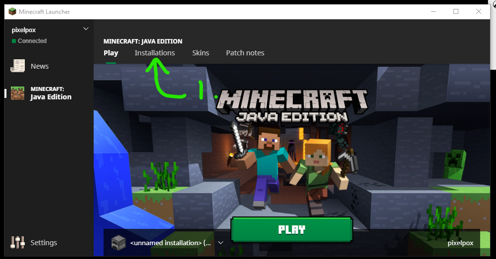

# How to update minecraft client

1. Click on Installations button

2. Click on the new... button

3. Give your install a name
4. Select the right version the server is asking for
5. Click the create button

6. Click the play button on the top bar to get back to the main splash screen

7. Make sure your profile is selected in the bottom left hand corner
8. Click the green play button and happy crafting!

